# Hi there 👋

- 🔭 I’m currently working on ... { https://gitlab.com/users/tonisun/projects, ...}
- 🌱 I’m currently learning ... { https://www.udemy.com/course/master-microservices-with-spring-docker-kubernetes, ...}
- 👯 I’m looking to collaborate on ... 100 % HomeOffice work in Java Spring Boot Application Development
- 🤔 I’m looking for help with ... Java, Python, PHP, JS, C, PostgreSQL, MySQL 
- 💬 Ask me about ... { Yoga, God, ... }
- 📫 How to reach me: ... https://www.egosanto.de/
- 😄 Pronouns: ... Full Stack Software Engineer 
- ⚡ Fun fact: ...  My cock gets bigger when I see naked guys

<!--
**tonisun/tonisun** is a ✨ _special_ ✨ repository because its `README.md` (this file) appears on your GitHub profile.

Here are some ideas to get you started:

- 🔭 I’m currently working on ...
- 🌱 I’m currently learning ...
- 👯 I’m looking to collaborate on ...
- 🤔 I’m looking for help with ...
- 💬 Ask me about ...
- 📫 How to reach me: ...
- 😄 Pronouns: ...
- ⚡ Fun fact: ...
-->
